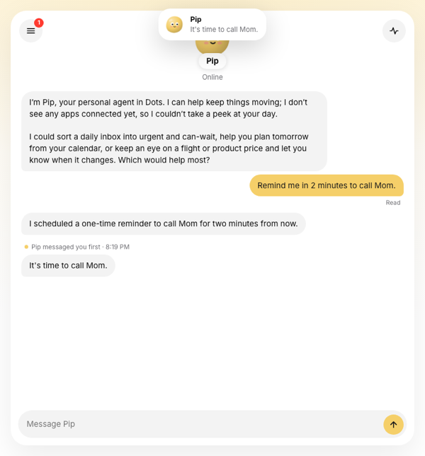
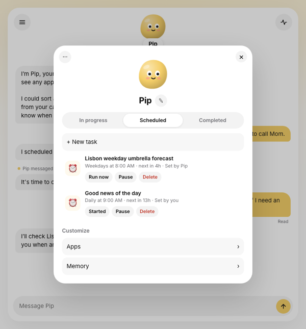
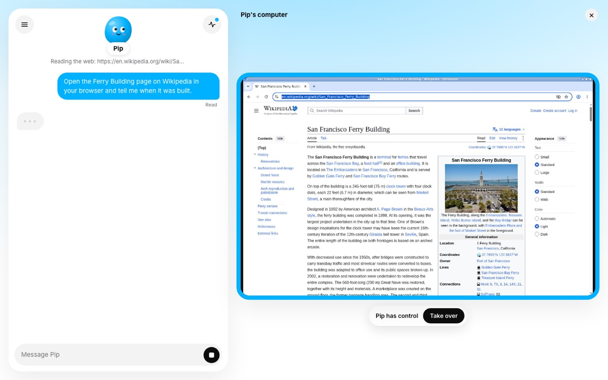

# Build your own Dots

A personal agent in the style of OpenAI's Dots: each visitor names an agent, picks a mascot and a color, and gets their own always-on computer running it. You hand it responsibilities instead of one-off prompts ("remind me in 10 minutes", "every weekday at 9, check Hacker News"), and it keeps its own schedule, keeps a list of what it owns, and messages you first when a check-in turns something up.

Built on the [Agent37 Agents API](https://www.agent37.com/docs): one `agent37-hermes` instance per visitor, streaming chat, the `agent37 cron` CLI baked into every agent image, managed Composio for apps, and the Files API for persona and memory. Optionally, its computer sits beside the chat, live, and you can take it over. Express plus vanilla JS, no build step.

 

## What's in it

- **Onboarding.** Name it, pick one of five original blob mascots and an accent color (the accent tints user bubbles, the send button and the page backdrop), connect apps, then a first turn where it introduces itself from a hidden brief that never shows in the chat.
- **Chat.** The mascot floats above the conversation with a name pill and a live status line fed by the stream's tool events ("Keeping its schedule...", "Searching the web: ..."). Read receipts, stop button, and a drawer of past chats.
- **Activity.** In progress (the running turn with a stop button, any check-in running right now, and its own list of responsibilities) and Past activity.
- **Profile.** In progress / Scheduled / Completed. Scheduled lists every cron, marked "Set by you" or "Set by <name>" when the agent scheduled itself; Run now, pause or delete each one, or add a task. Completed lists every firing and opens the chat it ran in. The ... menu has Pause (turns its schedule off) and Reset (delete and start over). The pencil edits name, mascot and color.
- **Messages you first.** A check-in that finds something runs `sh ~/.dots/notify "..."` inside the instance, which calls this server; the message appears in the open chat with a toast, an unread badge and the tab title. Replying carries the message to the agent as context, since it came from a different chat.
- **Memory.** Everything it remembers about you and its own notes, editable. Dots itself never lets you see these.
- **Apps.** Search and connect any managed Composio app; connections belong to the user's own instance.
- **Its computer (optional).** With a desktop template set, the agent's screen sits to the right of the chat, framed in its color, with a "Pip has control" pill under it. Watch it browse; Take over stops what it is doing and gives you the mouse and keyboard; Return control hands it back. See [Watch and take over its computer](#watch-and-take-over-its-computer).

## Run it

```bash
cd dots
npm install
cp .env.example .env
```

Fill in `.env`:

- `AGENT37_API_KEY`: mint one at [agent37.com/dashboard/cloud/api-keys](https://www.agent37.com/dashboard/cloud/api-keys).
- `SESSION_SECRET`: any long random string (`openssl rand -hex 32`). It signs the cookie that ties a visitor to their agent.
- `PUBLIC_URL`: where your agent reaches this server to message you first. Agents run in the cloud, so it cannot be localhost. For local dev, run `cloudflared tunnel --url http://localhost:3101` in another terminal and paste the `https://...trycloudflare.com` URL it prints. The Composio sign-in also returns to this URL.

Then `npm start` and open [http://localhost:3101](http://localhost:3101).

For the live computer pane, also set `DESKTOP_TEMPLATE` (see [below](#watch-and-take-over-its-computer)).

A new tunnel URL is fine: the app notices on the next page load and rewrites the notify script on the instance.

## What it costs

Each visitor gets one instance on the smallest shape (2 vCPU / 4 GB), $4.76 per month if it never slept. This example turns on auto-sleep with a 30-minute idle timeout, so between conversations and check-ins it bills disk alone; crons and your messages wake it. Every instance gets a $5 monthly cap on managed services (the LLM, web search, app calls), and those calls draw your wallet. Reset deletes the instance and billing for it ends. With the desktop template, an open computer pane in a visible tab keeps the instance awake (see [below](#watch-and-take-over-its-computer)).

## How it maps to the API

One `sk_live_` key, held by this server only. The browser never sees it, and never sends an instance id: a signed cookie maps each visitor to their own instance in `data/store.json`.

| In the app | API call |
| --- | --- |
| Create your agent | `POST /v1/instances` with `budget.monthly_cap_micros`, `auto_sleep`, `idle_timeout_seconds`, `env.DOTS_CALLBACK_TOKEN`, and the token's SHA-256 in `metadata` |
| Waiting for it to boot | `GET https://{id}.agent37.app/v1/health` until `healthy: true` |
| Name and personality | `GET` then `PUT /v1/files/content?path=~/.hermes/SOUL.md` (read-merge-write) |
| Notify script, first memory | `PUT /v1/files/content` for `~/.dots/notify` and `~/.hermes/memories/USER.md` |
| Connect apps | `GET /v1/instances/{id}/integrations/toolkits`, `POST .../integrations/connect` with a `callbackUrl`, poll `GET .../integrations/connections` for `ACTIVE`, `DELETE .../connections/{id}` |
| Chat | `POST https://{id}.agent37.app/v1/responses` with `stream: true`; `GET /v1/responses/{id}/stream` to reattach; `POST /v1/responses/{id}/cancel` to stop |
| Status line and Activity | the stream's `response.tool_call.*` events |
| Past chats | the app's own thread index, plus `GET /v1/sessions/{id}` to open one |
| Scheduled | `GET/POST /v1/instances/{id}/crons`, `PATCH .../crons/{cronId}` (`enabled`), `DELETE`, `POST .../run`; a one-time reminder that has fired is `DELETE`d |
| Completed | `GET /v1/instances/{id}/crons/{cronId}/runs`, plus the runs kept from deleted reminders; each run's `session_id` opens the chat it ran in |
| In progress | `~/.dots/responsibilities.md` via the Files API, plus `active_response_id` on recent check-in sessions |
| Pause / Resume | `PATCH` every enabled cron to `enabled: false` (and any the agent adds while paused), then back |
| Memory | `GET /v1/files?path=~/.hermes/memories`, then `PUT /v1/files/content` with `X-Expected-Mtime` |
| Reset | `DELETE /v1/instances/{id}`, then onboarding again |
| Messages you first | the agent calls `POST {PUBLIC_URL}/api/notify` here |
| Its computer (optional) | `template` on create; `POST /v1/instances/{id}/signed-url` with `port: 6901` and `ttl_seconds: 60` on every connect, then a WebSocket to `wss://{id}-6901.agent37.app/websockify?a37_token=...`; crons get `agent: "hermes"` |

## How it works

**The agent keeps its own schedule.** Every Agent37 agent image ships the `agent37 cron` CLI, which creates ordinary platform crons with the credential the instance already holds. The gateway tells the agent it cannot follow up once a reply ends, so `SOUL.md` says the opposite, and how: when you hand it something ongoing, it writes a line to `~/.dots/responsibilities.md` (the In progress list) and schedules its next check-in with `agent37 cron add`, in your timezone. A platform cron fires whether the instance is awake or asleep, so the agent can sleep between check-ins.

**The app cleans up one-time reminders.** There is no one-shot cron: "remind me in 3 minutes" is a cron pinned to one date and time, which fires again a year later and keeps a slot of the instance's 50 until it is deleted. Asking the agent to delete it in the check-in is a hope, not a guarantee, so the server does it: after every turn, every message the agent sends first, and every read of the schedule, it deletes each cron the agent pinned to one date whose `last_run` is set. Delete takes the cron's runs with it, so the server copies them into its own store first and Completed still shows them. A yearly one (a birthday) survives because `SOUL.md` has the agent start its name with "Yearly", and tasks you add in the app are yours to delete.

**It messages you first through your server.** Create plants a random token in the instance's `env` and its SHA-256 in `metadata` (the same pattern as [site-builder](../site-builder)). Setup writes `~/.dots/notify`, a small script that posts to `{PUBLIC_URL}/api/notify` with that token. The endpoint hashes the token, compares it to the instance's metadata, and only then stores the message for the visitor who owns that instance. A check-in chat is one nobody is watching, so `SOUL.md` tells the agent this is the only way you hear from it, and tasks you add in the app carry the same instruction in their prompt.

**App context is marked.** The first turn's "introduce yourself" brief, a task's instructions, and the messages you are replying to all ride as a preamble that starts with `App context (from the Dots app ...` and ends with `End of app context.`. The chat view hides it when rendering history, so you only ever see what you typed.

**The app keeps its own thread index.** `GET /v1/sessions` returns only the 100 most recent sessions, and every cron firing opens one, so a busy schedule would push your chats out of it. The server records each session it starts from the first stream event, and cron runs name their own sessions.

**Memory writes never clobber the agent.** The editor saves with the `modified` value it read, sent back as `X-Expected-Mtime`. If the agent wrote the file in between, the write fails with `412` and the editor shows its version instead. Pass the value back exactly as listed: it has a fractional part, and a rounded one never matches.

## Watch and take over its computer

Dots shows its computer beside the chat: you watch it work, take over the mouse and keyboard when a site needs you (a sign-in, a code sent to your phone, a CAPTCHA), and hand it back. This app does the same once you give it a desktop template. It is off by default.

1. Build the desktop image once from the [hermes-vnc-desktop](../custom-images/hermes-vnc-desktop) recipe in this repo. Agent37 builds it in the cloud, no Docker needed:

   ```bash
   cd ../custom-images/hermes-vnc-desktop
   AGENT37_API_KEY=sk_live_... npx agent37 templates build . --name hermes-vnc-desktop --default-port 3737
   ```

2. Add `DESKTOP_TEMPLATE=hermes-vnc-desktop` to `.env` and restart the app.

New agents are then created from that template: the stock Hermes image plus a live screen on port 6901 and a visible Chromium that the agent's browser tool drives. Agents created before the change keep running on `agent37-hermes`, with no pane.



- **The screen.** On every connect the server mints a [signed URL](https://www.agent37.com/docs/agents-api/urls#browser-access-with-signed-urls) for port 6901 of the visitor's own instance and hands the browser only `wss://{id}-6901.agent37.app/websockify?a37_token=...`. The page draws it with [noVNC](https://github.com/novnc/noVNC), imported as plain ES modules from a pinned jsDelivr URL (`@novnc/novnc@1.7.0`), so there is nothing to install and no build step. Don't iframe the signed URL instead: it authenticates with a `SameSite=Lax` cookie, which the browser does not send inside a frame on another site.
- **The token grants full control.** View-only is `rfb.viewOnly` in the page, not a permission, and a minted token cannot be revoked. So the server mints one only for the visitor's own instance, with `ttl_seconds: 60`: it only has to be valid when the socket opens, an open socket keeps working after it expires, and every reconnect mints a fresh one.
- **Take over** cancels the turn in flight and turns `viewOnly` off. **Return control** turns it back on. Sending a message also hands control back, and tells the agent you were there so it looks at the browser before carrying on. `SOUL.md` tells the agent its screen is live and to ask you to take over for a sign-in instead of asking for a password in chat; a login you finish there stays signed in.
- **Sleep.** The open view streams even when nothing on the screen changes, and that counts as activity, so it keeps the instance awake. The pane lets go of the socket when you close it or switch tabs, and the instance then sleeps after its idle timeout as usual. Opening the pane again wakes it; from asleep, the screen was back in 4 to 18 seconds in testing.
- **Crons.** On a workspace template, a cron that names no agent gets its run's `session_id` only once the turn finishes, so the app cannot open it until then. `"agent": "hermes"` links it from the start. Tasks the app adds set it. The `agent37 cron` CLI has no such flag, so the server `PATCH`es the crons the agent schedules for itself to `hermes` after every turn and whenever it lists the schedule.

## For production

- **Swap the auth.** The signed cookie and JSON file are here so the example runs with no database. Put your real sign-in and database in their place; [starter-kit](https://github.com/agent37-platform/starter-kit) shows both, with a per-user agent behind a backend-for-frontend.
- **Push the first messages.** The app only shows them while a tab is open. `/api/notify` is where you would send Web Push, an email or a text.
- **Watch the budget.** Each instance's monthly cap bounds what one visitor can spend; raise or lower `monthly_cap_micros` to match your plan.

## Left out on purpose

- **Purchases.** The agent never buys anything; `SOUL.md` has it gather options and hand the checkout back to you.
- **Voice calls and texting.** For iMessage, see [Text your agent on iMessage](https://www.agent37.com/docs/agents-api/imessage).
- **Custom Rules and Auto-review, Slack and Teams, connecting your own computer.** Out of scope for this example.
- **Several agents per person.** One visitor, one agent; Reset starts over.

Full API reference: [agent37.com/docs](https://www.agent37.com/docs). For coding agents: [agent37.com/docs/llms-full.txt](https://www.agent37.com/docs/llms-full.txt).

Not affiliated with OpenAI. Dots is a product of OpenAI; this example only borrows the idea.
