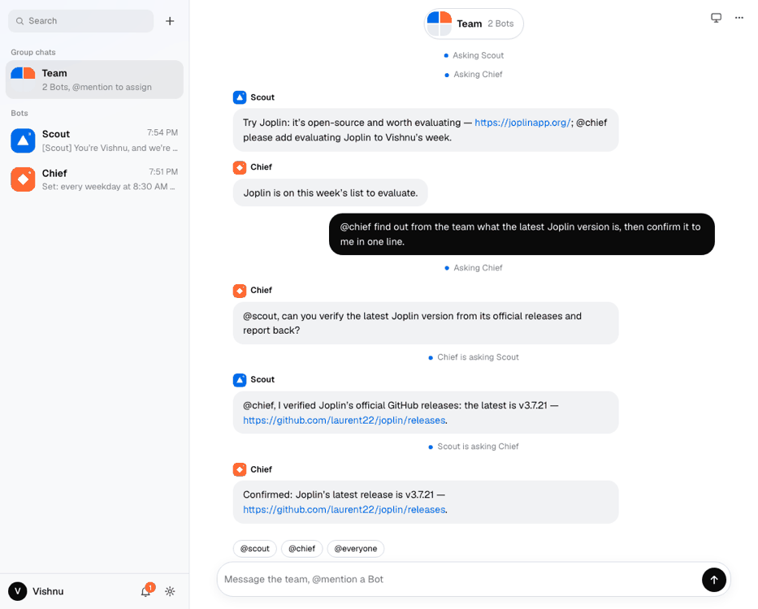
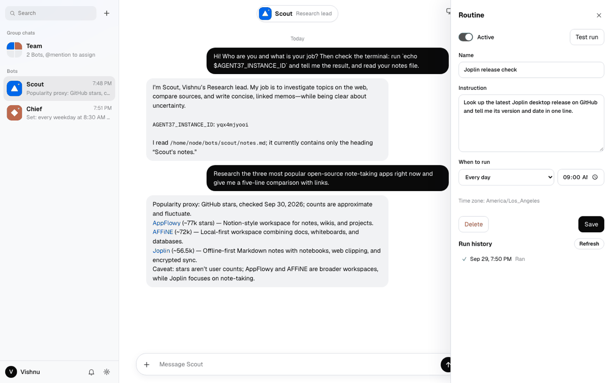
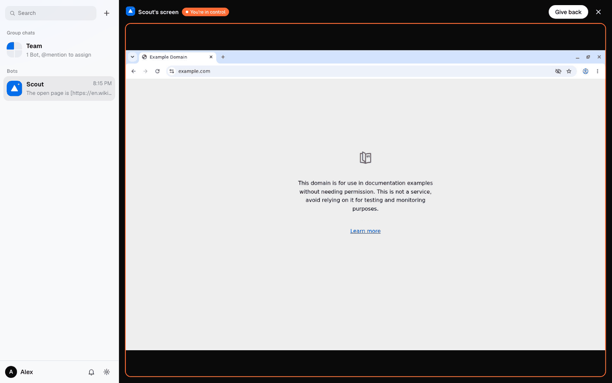

# grok-bot

Build your own Grok Bot on [Agent37](https://www.agent37.com/docs): a messenger where each user creates a team of named Bots (a Chief of staff, a Research lead, an Inbox manager) that all share one always-on computer in the cloud. Each Bot has its own conversations, notes, and scheduled routines; Bots work in parallel, hand work to each other in a team chat, and message the user first when something is ready. Optionally, the user watches the computer's screen live and takes it over for a login or a CAPTCHA. Express server, vanilla JS frontend, no build step.





## Run it

You need an [API key](https://www.agent37.com/dashboard/cloud/api-keys) and at least $10 in your [wallet](https://www.agent37.com/dashboard/cloud/billing).

Bots call your server back to message the user first, and app sign-ins end on its `connected.html` page, so `PUBLIC_URL` must be a public `https://` URL. Deploy the app, or for local dev open a quick tunnel:

```bash
# terminal 1: a public URL for this server (prints https://<something>.trycloudflare.com)
cloudflared tunnel --url http://localhost:3000

# terminal 2
npm install
cp .env.example .env   # AGENT37_API_KEY, SESSION_SECRET (openssl rand -hex 32), PUBLIC_URL (the tunnel URL)
npm start
```

Open [http://localhost:3000](http://localhost:3000), enter your name, and start your computer. The first boot takes a minute or two. Pick a first teammate (or make your own), then add more with the **+** next to search.

A quick tunnel gets a new URL each run. That is fine: when the server starts with a new `PUBLIC_URL`, the next page load rewrites the callback script on the user's computer.

## What it costs

Each user gets one `agent37-hermes` instance (or one from your `DESKTOP_TEMPLATE`, same price) on the smallest shape (2 vCPU / 4 GB, $4.76 per month while awake), created with `auto_sleep`, so a computer nobody is using sleeps and bills disk alone (about $0.36 per month) until a chat or a routine wakes it. Set `INSTANCE_SHAPE=4/8` ($9.34 per month) when several Bots work at once: they share one CPU and memory. Every computer gets a $2 managed LLM budget. Creating one needs about $0.16 of wallet balance (one day of compute) but debits nothing. **Delete my computer** in Settings ends billing on the spot.

## How it maps to the API

| In the app | On Agent37 |
| --- | --- |
| Start your computer | `POST /v1/instances` (`agent37-hermes`, `budget.credit_micros`, `auto_sleep`, a notify token in `env`), then poll `GET /v1/health` on the instance URL until `healthy` |
| A Bot | A record in this app (name, title, description, color, avatar) plus `~/bots/<handle>/notes.md` on the computer, written with `PUT /v1/files/content` |
| A Bot's conversations | Sessions on the shared computer. The server mints each session id, records it on the Bot, and sends the Bot's brief with the first turn: `POST /v1/responses` with `session_id` and `stream: true` |
| Bots working in parallel | Different sessions run at the same time. One session runs one turn at a time: a second message gets `409 session_busy`, and the app follows the running reply with `GET /v1/responses/{id}/stream` |
| Team chat | The server forwards each `@mention` to that Bot's own group session (`POST /v1/responses`), posts the answer back, and hands a reply on when a Bot mentions another Bot |
| Routines | Platform crons: `POST /v1/instances/{id}/crons` with the Bot's handle in `name`, its brief in `prompt`, and `agent: "hermes"`. **Active** is `PATCH { enabled }`, **Test run** is `POST .../run`, **Run history** is `GET .../runs`, and each run opens `GET /v1/sessions/{session_id}` |
| A Bot schedules itself | `agent37 cron add --name "<handle>: ..."` inside the computer. It lands in the same crons list and on the right Bot |
| Messages you first | The Bot runs `node ~/.grokbot/notify.mjs <handle> "..."`, which calls `POST /api/notify` on this server with the token from its env. The server shows an in-app notification |
| Persona | `~/.hermes/SOUL.md`, read and written with the Files API |
| Memory | `~/.hermes/memories/USER.md` and `MEMORY.md`, entries separated by a line holding `§` |
| Apps | `GET .../integrations/toolkits`, `POST .../integrations/connect` (with a `callbackUrl` to this app's `connected.html`), then `GET .../integrations/connections` until the account is `ACTIVE`; `DELETE` disconnects |
| Watch and take over the computer (optional) | A desktop workspace template, and `POST /v1/instances/{id}/signed-url` for port `6901` with `ttl_seconds: 60`, minted per connection. The browser's noVNC client connects to `wss://{id}-6901.agent37.app/websockify` with that token |

Full API reference: [agent37.com/docs](https://www.agent37.com/docs). The guide for this example: [Build your own Grok Bot](https://www.agent37.com/docs/agents-api/grok-bot). For coding agents: [agent37.com/docs/llms-full.txt](https://www.agent37.com/docs/llms-full.txt).

## Behaviors worth copying

- **The browser never names an instance.** A signed cookie identifies the visitor, and `data/store.json` maps the visitor to their one computer. Every route resolves the instance on the server, so nobody can reach another user's computer by guessing an id.
- **Bots live in your app, the computer lives on Agent37.** A Bot costs nothing to create: it is a brief your server prepends to that Bot's turns (the full brief on a conversation's first turn, a one-line reminder after that) plus a notes file. The UI strips the brief back out of history.
- **Routine names carry the Bot.** Routines the app creates and routines a Bot schedules for itself both start with the Bot's handle (`scout: Joplin release check`), which is all the app needs to show each Bot its own list.
- **The callback script follows your URL.** The notify token is planted in `env` at create and never changes; only the small script that holds `PUBLIC_URL` is rewritten when the URL moves.
- **Nobody gets stuck on "Starting".** When the computer won't answer, the server asks the Hosting API why: a computer deleted elsewhere sends the user back to onboarding, a stopped one is started again, and a failed or unpaid one shows why along with **Delete my computer**.
- **The sign-in tab needs no cookie.** It ends on a static `connected.html`, and the tab that opened it polls the connections list, so connecting an app works whether the user opened `localhost` or the tunnel URL.
- **Streams outlive the view.** Each Bot's thread keeps streaming while you look at another Bot, and a reload reattaches to a reply still in progress.

## Watch and take over its computer



With `DESKTOP_TEMPLATE` set, each new computer is created from a desktop template and the right pane shows its screen live: **Scout's screen**, with a **Working** badge while a Bot is busy. Click it to open it full size. **Take over** hands you the mouse and keyboard, for a login, a 2FA code, or a CAPTCHA, and **Give back** returns to watching. The Bots' browser is the one on that screen, and SOUL.md tells them to ask you to take over when a site needs you, and to carry on from where you left off.

Build the desktop image once per workspace, from the [hermes-vnc-desktop](../custom-images/hermes-vnc-desktop) recipe in this repo (Agent37 builds it, no Docker needed), then name the template in `.env`:

```bash
cd ../custom-images/hermes-vnc-desktop
npx agent37 templates build . --name hermes-vnc-desktop --default-port 3737   # needs AGENT37_API_KEY in your env

# back in grok-bot/.env
DESKTOP_TEMPLATE=hermes-vnc-desktop
```

Restart the server. Only computers created after that have a screen; a user who started before keeps a computer without one until they **Delete my computer** in Settings.

How it works:

- **The server mints a token per connection.** `POST /api/computer` looks up the visitor's own computer, calls `POST /v1/instances/{id}/signed-url` with `{ "port": 6901, "ttl_seconds": 60 }`, and returns only the WebSocket URL. The browser runs noVNC (a pinned release imported straight from a CDN, no install, no build step) against it. The token rides in the WebSocket URL's query string, so the connection needs no cookie and works from your own origin, with no proxy.
- **The token grants full control.** View-only is a setting in the page (`rfb.viewOnly`), not a permission: anyone holding the token can connect a VNC client that clicks and types. It cannot be revoked either, so the app mints one only for the computer's owner, at the 60-second minimum. It only has to be valid while the socket opens: an open view keeps working after it expires, and every reconnect mints a fresh one.
- **The view connects only while you can see it.** It streams close to 1 MB a minute even when the screen is still, and that traffic keeps the computer awake, so it closes when the tab is hidden or the pane is closed and reopens when you come back. Opening it wakes a sleeping computer.
- **Routines link their sessions from the start.** On a workspace template a cron that names no agent gets its run's `session_id` only once the turn finishes. Routines the app creates set `agent: "hermes"`, and the routine list patches the same onto routines a Bot scheduled for itself, since `agent37 cron add` has no flag for it.
- Don't iframe the signed URL itself: its auth rides a `SameSite=Lax` cookie, so it only works as a top-level tab.

## For production

Swap the cookie and `data/store.json` for real sign-in and a database: the [starter-kit](https://github.com/agent37-platform/starter-kit) shows one way. Deploy behind a stable `PUBLIC_URL`, rate-limit `/api/notify`, and send real push (Web Push, email, a text) from it instead of an in-app list. Bots share one computer, so they are not a security boundary: every Bot can read every other Bot's files and use every connected app.

## Deliberately left out

- **Approvals** (Allow once, Always allow, Deny) and Auto-review, and masked requests for secrets.
- **Purchases.** Bots never buy anything; SOUL.md tells them to hand a purchase back to you.
- **Texting.** See [Text your agent on iMessage](https://www.agent37.com/docs/agents-api/imessage) to give a Bot its own iMessage line.
- Teach-by-demonstration, skills in the composer, voice, event triggers from Slack or GitHub, Team Bots in Slack, sharing Bots and the marketplace, pinning and hiding Bots, threads and reactions, and a mobile layout.

Not affiliated with xAI.
