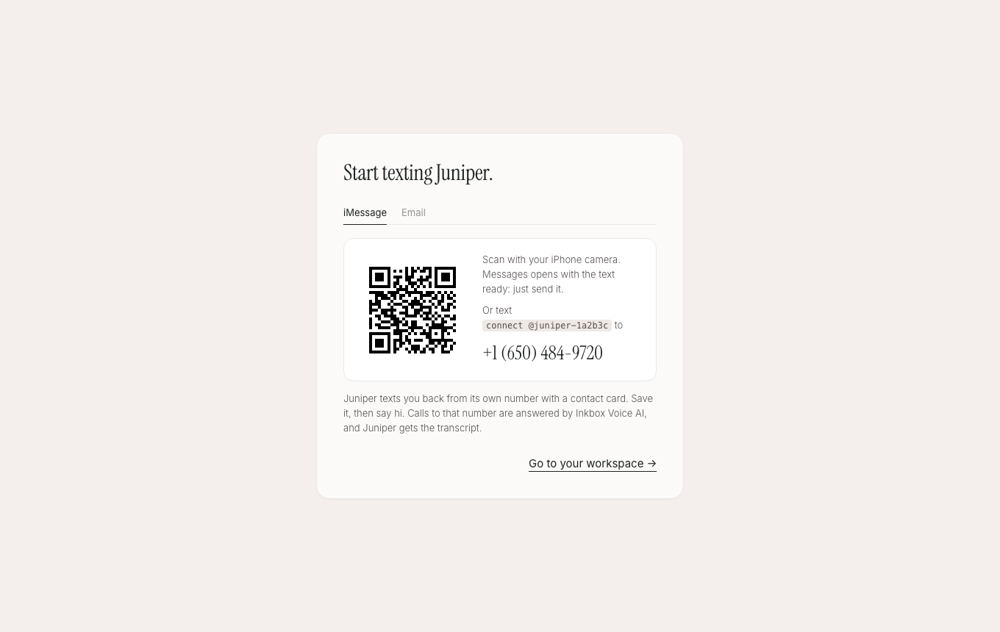
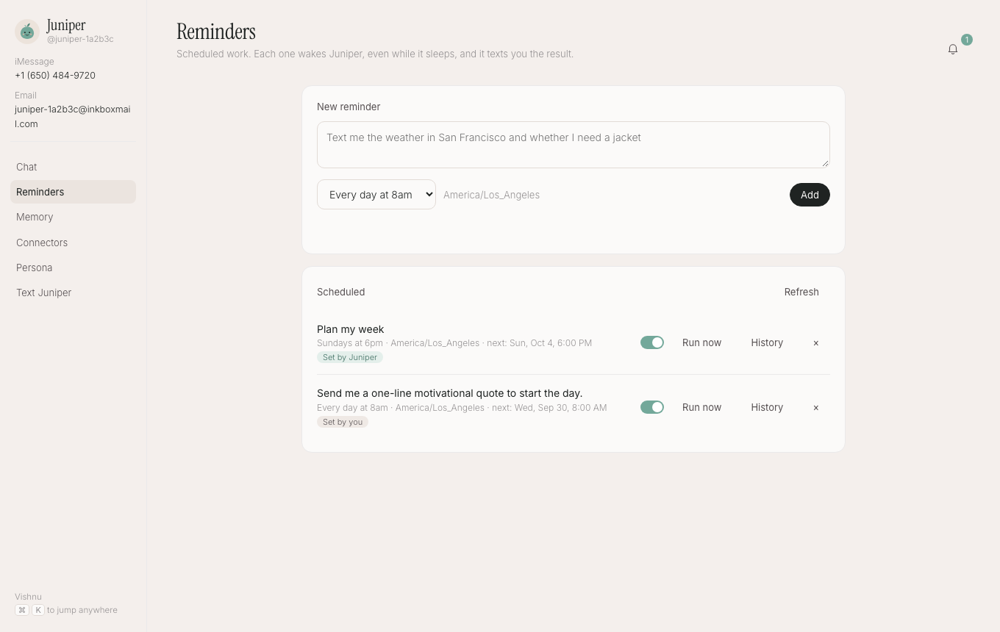

# Build your own Instinct

A texting assistant on [Agent37](https://www.agent37.com/docs): each user gets their own agent with its own computer, its own iMessage line, its own email address, and phone calls, through [Inkbox](https://inkbox.ai). Users text it like a friend, it remembers across channels, it texts them first when a reminder fires, and a quiet web workspace (modeled on Instinct's) holds the chat, reminders, memory, connectors, and persona. Express server, vanilla JS frontend, no build step.



## What it does

- **Signup provisions everything.** One form (your name, your mobile number, your email, a name for the assistant) creates an `agent37-hermes` instance, an Inkbox identity that only your number and your email address can reach, and wires the two together in about a minute.
- **Start texting.** Scan the QR code (or tap **Open Messages** on a phone). Messages opens with `connect @juniper-1a2b3c` drafted to the Inkbox router; send it, save the contact card, say hi.
- **Email and calls.** The same identity has a mailbox (`juniper-1a2b3c@inkboxmail.com`) that takes mail from your address. Calls to the iMessage line are answered by Inkbox Voice AI, and your assistant gets the transcript.
- **It texts you first.** Reminders are Agent37 crons: they wake the instance even while it sleeps, and the agent texts you the result. The agent also schedules its own with the baked-in `agent37 cron` CLI when you text "remind me to...".
- **Workspace.** Chat (streaming, with your iMessage and email threads listed alongside, read-only, since a reply typed in the app would never reach your phone or inbox), Reminders (yours and the ones the agent set), Memory (`USER.md` and `MEMORY.md`, editable), Connectors (managed Composio: Gmail, Calendar, Notion, and hundreds more), Persona (`SOUL.md`), in-app notifications the agent posts, and a Cmd-K palette.



## Run it

You need an Agent37 [API key](https://www.agent37.com/dashboard/cloud/api-keys) with at least $10 in your [wallet](https://www.agent37.com/dashboard/cloud/billing), and an Inkbox account: sign up at [inkbox.ai](https://inkbox.ai) and mint an **admin-scoped** key in the Console (admin keys are Console-only). The Free plan covers 3 identities, so 3 users.

The agent calls your server back (notifications), and Composio sends users back to it after OAuth, so `PUBLIC_URL` must be a public `https://` URL. Deploy the app, or for local dev open a quick tunnel:

```bash
# terminal 1: a public URL for this server (prints https://<something>.trycloudflare.com)
cloudflared tunnel --url http://localhost:3102

# terminal 2
npm install
cp .env.example .env   # AGENT37_API_KEY, INKBOX_ADMIN_KEY, SESSION_SECRET, PUBLIC_URL
npm start
```

Open [http://localhost:3102](http://localhost:3102) and click **Get your assistant**. The agent's `SOUL.md` carries the `PUBLIC_URL` it notifies; a quick tunnel gets a new URL each run, so after restarting with a new one, save the persona once (Persona, **Save**) to rewrite it; conversations started after that use the new URL.

## How it maps to the API

| Step | Call |
| --- | --- |
| The user's computer | `POST /v1/instances` with `public_ports: [{ port: 8765 }]`, `auto_sleep: true`, a `budget.credit_micros`, and a notify token in `env` |
| The user's phone line and inbox | Inkbox `POST /identities` (`imessage_enabled: true`), `PUT /identities/{handle}/avatar`, then `PATCH /identities/{handle}` with `phone_filter_mode` and `mail_inbound_filter_mode` set to `whitelist`, plus one `allow` rule for your number and one for your email address |
| A key only for that line | Inkbox `POST /api-keys` with `scoped_identity_id` (the admin key never enters the instance) |
| iMessage, email, calls | One `POST /v1/instances/{id}/exec`: SDK into the Hermes venv, `hermes plugins install inkbox-ai/hermes-agent-plugin --enable`, `INKBOX_PUBLIC_URL` set to the public-port URL, `hermes inkbox bootstrap --identity ... --api-key-stdin --voice-ai --rotate-signing-key` |
| Persona | `PUT /v1/files/content?path=~/.hermes/SOUL.md` on the instance URL (Hermes reads it when a conversation starts, so an edit reaches new conversations with no restart) |
| Start texting screen | Inkbox `GET /imessage/triage-number?agent_identity_id=...` (number, connect command, `sms:` link, QR) |
| Chat | `POST /v1/responses` (streamed), `GET /v1/sessions` on the instance URL |
| Memory | `GET`/`PUT /v1/files/content` for `~/.hermes/memories/USER.md` and `MEMORY.md` |
| Reminders | `/v1/instances/{id}/crons` (create, list, pause, run now, runs) |
| Connectors | `/v1/instances/{id}/integrations/*`, with `callbackUrl` pointing at this app's "go back to your messages" page |
| Notifications | The agent runs `curl $PUBLIC_URL/api/notify` with its notify token; the server checks the token's hash |

Behaviors worth copying:

- **Webhooks, not the tunnel.** With `INKBOX_PUBLIC_URL` set, Inkbox POSTs signed events to the instance's public port, and a request to a public port wakes a sleeping instance. Without it, the plugin holds an outbound tunnel open, which never wakes a sleeper. So instances run with `auto_sleep` on and bill disk alone between messages.
- **The SDK survives updates.** `POST /v1/instances/{id}/update` resets everything outside `/home/node`, including the Hermes venv the Inkbox SDK lives in. Setup appends one guarded line to `~/.agent37/hooks/post-restart.sh`, which runs on every boot and reinstalls the SDK only when `import inkbox` fails. (`post-image-update.sh` runs only when the image changes, so it misses an update to the same image.)
- **Owner-only line.** Inkbox identities accept anyone by default, and whoever gets through runs a full turn with your memory, your connected apps, and a terminal. So setup puts the identity in whitelist mode for phone and incoming mail, with one allow rule for your number and one for your address. The agent can still send mail to anyone, but Inkbox holds replies from other people instead of delivering them. Changing either in Persona adds the new rule, then deletes the old one. Rules need the admin key, so this server sets them, never the instance.
- **What the lock does not cover.** An email rule matches the From address, and From addresses can be forged, so treat email as a weaker lock than your number. Anything the agent reads on the web or in your connected apps can still carry instructions; `SOUL.md` tells it to treat other people's words as information, which is a prompt, not a control.
- **Setup survives a lost response.** A create can finish after this server stops waiting for it. Before creating, setup looks for an instance tagged with the user's id (`GET /v1/instances`) and for the Inkbox handle it saved, so a retry reuses them instead of leaving an orphan billing in your workspace.
- **Readiness, stream reattach, cancel, empty-reply-means-budget**: inherited from [hermes-chat](../hermes-chat).

Full API reference: [agent37.com/docs](https://www.agent37.com/docs). For coding agents: [agent37.com/docs/llms-full.txt](https://www.agent37.com/docs/llms-full.txt). The guide for this example: [Build your own Instinct](https://www.agent37.com/docs/agents-api/instinct).

## What it costs

Per user: an Agent37 instance at the 2 vCPU / 4 GB shape bills about $0.36 a month asleep and $4.76 a month if it never sleeps, plus the model spend its $2 budget caps. Inkbox is free for 3 users, $30 a month for 10, and $200 a month for 100.

## Deliberately left out

- **Real auth.** A signed cookie maps a visitor to their assistant in `data/store.json`. Swap in real auth before production; the [starter-kit](https://github.com/agent37-platform/starter-kit) has it.
- **Verifying the number and email.** Neither is checked with a code, so a user could lock the line to someone else's number or address. Add an OTP step if that matters to you.
- **Purchases.** The agent never pays for anything: it gets a checkout ready and texts you the link.
- **Texting cold.** On Inkbox's shared lines the user must text first (`connect @handle`). A dedicated line that can start conversations comes with Inkbox's Startup plan.
- **WhatsApp**, a vault, location sharing, and a Mac app.

This project is not affiliated with Instinct or Spear Street Technology.
