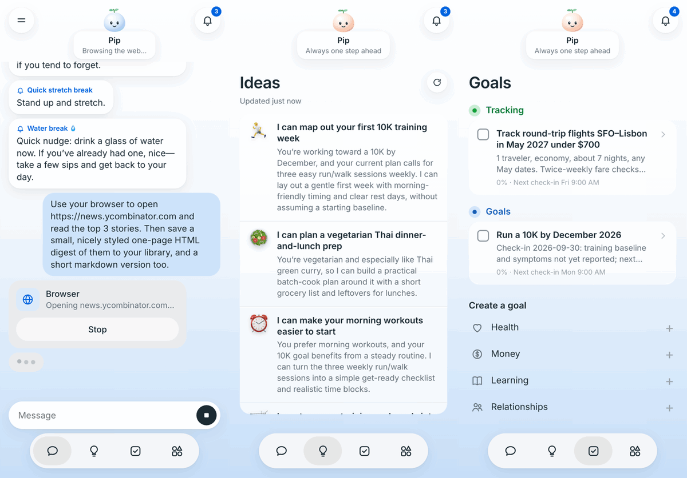

# muse

Build your own Muse: a personal agent app in the shape of Meta's Muse, on [Agent37](https://www.agent37.com/docs). Every visitor gets their own agent with its own always-on computer. You chat with it like a person (keep typing while it works, open side chats), it remembers you, it writes you ideas every morning, it tracks your goals on a schedule it sets itself, it keeps what it makes in a Library, and it messages you first when something needs you. Express server, vanilla JS frontend, no build step.



The guide for this example is [Build your own Muse](https://www.agent37.com/docs/agents-api/muse).

## Run it

You need an [API key](https://www.agent37.com/dashboard/cloud/api-keys) and at least $10 in your [wallet](https://www.agent37.com/dashboard/cloud/billing).

The agent runs in the cloud and calls this server when it messages the user first, so `PUBLIC_URL` must be reachable from the internet. Deploy the app, or for local dev open a quick tunnel:

```bash
# terminal 1: a public URL for this server (prints https://<something>.trycloudflare.com)
cloudflared tunnel --url http://localhost:3104

# terminal 2
npm install
cp .env.example .env   # AGENT37_API_KEY, SESSION_SECRET, and the tunnel URL as PUBLIC_URL
npm start
```

The tunnel or deployment exposes the whole app, not just `/api/notify`, and identity here is a cookie: anyone who opens the URL gets a new billed instance per browser, up to your workspace's instance limit. Keep the URL private until real auth is in front.

Open [http://localhost:3104](http://localhost:3104), tell it your name, name your agent, pick a look and a tone. Setup takes under a minute on a warm host and a few minutes on a cold one.

- `AGENT37_API_KEY`: your `sk_live_` key. It stays on this server.
- `SESSION_SECRET`: any long random string. It signs the cookie that maps a browser to its agent.
- `PUBLIC_URL`: where the agent reaches this server. Without it everything works except notifications. A quick tunnel gets a new URL each run; restart the server with the new one and the app rewrites each agent's callback script on the next page load.

## What it costs

Each visitor gets one `agent37-hermes` instance on the smallest shape with `auto_sleep` on and a 30-minute idle window: awake time bills $4.76 per month pro rata, asleep time bills its disk alone (about $0.36 per month). Each instance also gets a $2 monthly managed allowance (`budget.monthly_cap_micros`) for its model, search and app calls, the way Muse gives each user a weekly allowance; raise it for paying users. The daily ideas run and every reminder or check-in is one agent turn. Reset deletes the instance and ends its billing.

## How it maps to the API

One key, two planes, and the browser never sees either: every call goes browser -> `server.js` -> Agent37, and the server picks the instance from the visitor's cookie, never from the request.

| Muse | This app | API |
|---|---|---|
| Your agent and its computer | One instance per visitor, created on onboarding, readiness by polling health | `POST /v1/instances`, `GET /v1/health` |
| Name, tagline, tone, avatar | A marked block in `~/.hermes/SOUL.md`, rewritten read-merge-write, and a fresh main chat once the persona changes; the avatar is app-side art | `GET`/`PUT /v1/files/content` |
| Chat, side chats | Main chat plus side chats, each a session with an id this app mints and indexes | `POST /v1/responses` (`stream: true`), `GET /v1/sessions` |
| Send while it works | Messages typed during a turn wait in a client-side queue; a `409 session_busy` from another tab queues too and follows the running turn | `error.response_id`, `GET /v1/responses/{id}/stream` |
| Mascot status line | Driven by the stream's `response.*` events | SSE events |
| Browser card | Status only, narrated from `browser_*` tool events, with Stop | `response.tool_call.started`, `POST /v1/responses/{id}/cancel` |
| Ideas | A daily platform cron has the agent rewrite `~/muse/ideas.json`; tap an idea to send it | `POST /v1/instances/{id}/crons`, `.../run`, `GET /v1/files/content` |
| Goals | The agent keeps `~/muse/goals.json` and schedules each check-in itself with `agent37 cron`; the app joins goals to crons by id for the next check-in | `GET /v1/instances/{id}/crons` |
| Upcoming | Every cron on the instance, whether you or the agent made it: pause, run now, delete, add a reminder | crons CRUD |
| It messages you first | The agent runs `node ~/muse/notify.mjs`, which posts to this server's `/api/notify` with a token planted in the instance env at create; the server keeps the token's hash | `env` on create |
| Memory | Entries of `USER.md` and `MEMORY.md`, each edit a read-merge-write guarded by the file's mtime | `X-Expected-Mtime`, `overwrite=false` |
| Download your data | Memories only, as one Markdown file | `GET /v1/files/content` |
| Library | Everything under `~/muse/library`, HTML previewed in a sandboxed iframe | `GET /v1/files` |
| Connectors | Search, connect by OAuth link, disconnect | `/v1/instances/{id}/integrations/*` |
| Reset | Delete the instance, back to onboarding | `DELETE /v1/instances/{id}` |

Behaviors worth copying:

- **The app owns a marked block of SOUL.md, not the file.** The server reads the file, replaces what sits between `<!-- muse:begin -->` and `<!-- muse:end -->`, and writes it back, so anything else in the file survives. The block tells the agent about the app's files, that it can follow up with `agent37 cron` (the platform tells it by default that it cannot follow up once a response ends), and how to message the user first. The stock file introduces the agent as Hermes Agent, so the block also says it wins over anything else in the file.
- **A persona change starts a fresh main chat.** Hermes builds a session's system prompt, SOUL.md and memory included, on its first turn and keeps it for the rest of the session. So a saved name, tagline or tone moves the main chat to a new session id and files the old one under Chats; side chats and scheduled runs started after the change pick it up on their own. Memory edits follow the same rule: they reach the next session, not the one already running.
- **Memory edits merge.** Hermes writes its memory files as entries joined by `\n§\n`. An edit re-reads the file, applies the one change to the current entries, and writes back with `X-Expected-Mtime`; if the agent saved a memory in between, the write fails with `412 modified` and is re-applied on top, so neither side loses an entry.
- **"Updated" is the file's mtime.** The agent writes an `updated` field into `ideas.json`, but a model's idea of the current time is not something to render.
- **The browser only reads what it is allowed to.** The file routes take names under `~/muse/library`, never paths: the key can read any file on the instance, and `~/.hermes/config.yaml` holds the instance's managed-services token. The export covers memories only for the same reason.
- **Your own thread index.** `GET /v1/sessions` returns the 100 most recent sessions and every cron firing opens one, so the list of chats lives in this app's store.

Full API reference: [agent37.com/docs](https://www.agent37.com/docs). For coding agents: [agent37.com/docs/llms-full.txt](https://www.agent37.com/docs/llms-full.txt).

## Left out on purpose

- **Real auth.** Identity is a signed cookie and the store is `data/store.json`. For production, put your own sign-in in front and a database behind; [starter-kit](https://github.com/agent37-platform/starter-kit) is a multi-tenant dashboard with auth and per-user agents to fork.
- **Push notifications.** Notifications land in an in-app inbox and in the main chat. `/api/notify` is where you would fan out to Web Push, email, or a messaging channel.
- **WhatsApp.** Muse is also in WhatsApp; this app is not, because WhatsApp's business terms restrict general-purpose AI assistants. Telegram (every `agent37-hermes` instance already has a webhook public port for it) or iMessage are the texting channels to add.
- **A live browser view.** The stock image's browser is headless, so the Browser card shows status and Stop only. Watching or taking over needs a desktop image.
- **Purchases.** The agent can research and fill a cart; checkout is handed back to the user.
- **Feed, approval cards, per-connector Allow/Ask/Deny, the activity log.** Each is buildable on the same pieces, none is needed for the core loop.

Not affiliated with Meta.
